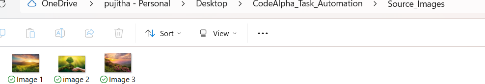
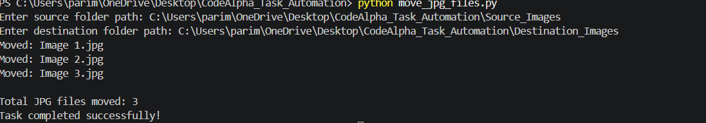

# CodeAlpha_Task_Automation
Python automation script that automatically moves JPG files from a source folder to a destination folder using OS and Shutil modules.
# CodeAlpha Task 3 - Task Automation with Python Scripts

## Project Overview

This project was developed as part of the CodeAlpha Python Programming Internship.

The automation script automatically moves all JPG image files from a source folder to a destination folder using Python. This helps organize files efficiently and reduces manual effort.

---

## Features

- Automatically detects JPG files
- Moves files from source folder to destination folder
- Displays moved files in the terminal
- Shows total number of files moved
- Beginner-friendly Python automation project

---

## Technologies Used

- Python
- OS Module
- Shutil Module

---

## Project Structure

CodeAlpha_Task_Automation/

├── move_jpg_files.py

├── Source_Images/

├── Destination_Images/

└── screenshots/

---

## How to Run

1. Open terminal in project folder.
2. Run:

```bash
python move_jpg_files.py
```

3. Enter source folder path.
4. Enter destination folder path.
5. The script will automatically move all JPG files.

---

## Screenshots

### Before Execution

Source folder containing JPG files.



---

### Script Output

Terminal output after running the script.



---

### After Execution

Files successfully moved to destination folder.


---

## Learning Outcomes

- Python Automation
- File Handling
- Directory Management
- Working with OS Module
- Working with Shutil Module

---

## Author

Pujitha Parimi

CodeAlpha Python Programming Internship
